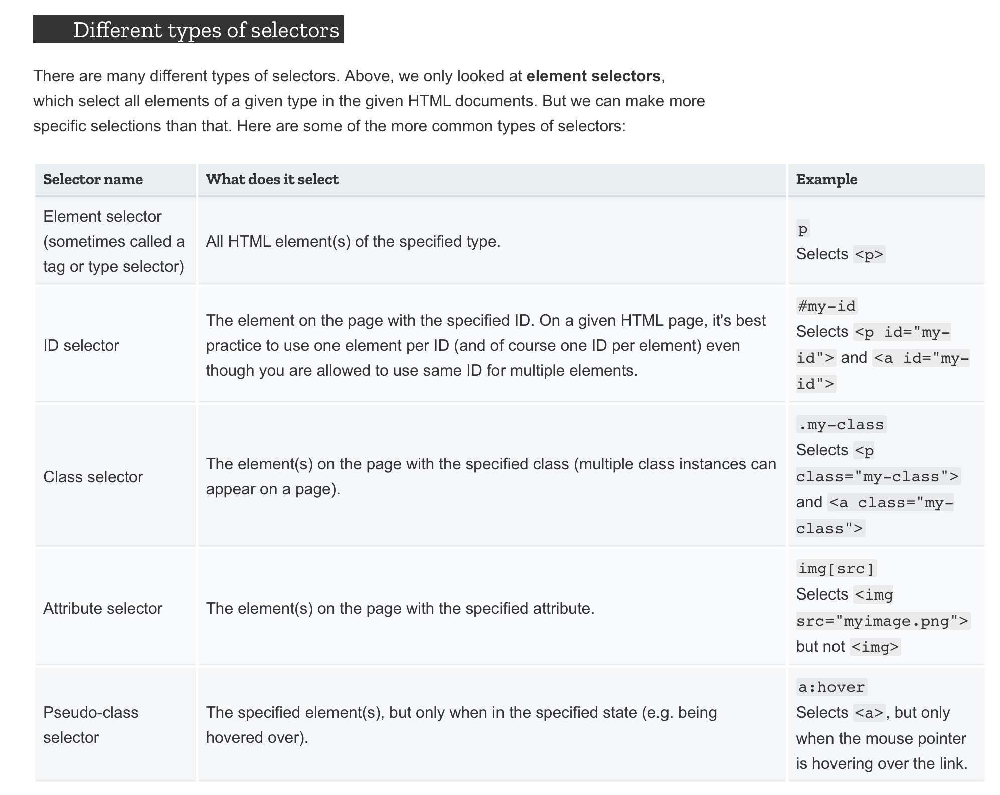

# css basic
## Whatz css

## about selector


## Basic elements 
### Fonts and text
```css
h1 {
  font-size: 60px;
  text-align: center;
}

p, li {
  font-size: 16px;    
  line-height: 2;
  letter-spacing: 1px;
}

```
### Boxes, boxes


- `padding`, the space just around the content (e.g., around paragraph text).
- `border`, the solid line that sits just outside the padding.
- `margin`, the space around the outside of the element.

- `width` (of an element).
- `background-color`, the color behind an element's content and padding.
- `color`, the color of an element's content (usually text).
- `text-shadow`: sets a drop shadow on the text inside an element.
- `display`: sets the display mode of an element (don't worry about this yet).