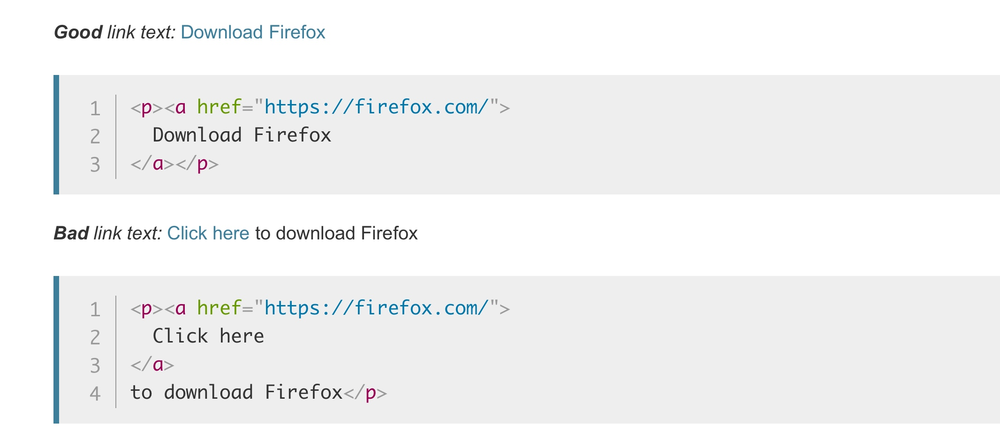

# 4 - Creating hyperlinks
[MDN](https://developer.mozilla.org/en-US/docs/Learn/HTML/Introduction_to_HTML/Creating_hyperlinks)

## DEMO
``` html
<!-- Adding supporting information with the title attribute -->
<p>I'm creating a link to
<a href="https://www.mozilla.org/en-US/"
   title="The best place to find more information about Mozilla's
          mission and how to contribute">the Mozilla homepage</a>.
</p>
```

```html
<!-- Block level links -->
<a href="https://www.mozilla.org/en-US/">
  
</a>
```

## Document fragments
It is possible to link to a specific part of an HTML document (known as a document fragment), rather than just to the top of the document. 
To do this you first have to **assign an id attribute to the element you want to link to**. *It normally makes sense to link to a specific heading*, so this would look something like the following:
```html
<h2 id="Mailing_address">Mailing address</h2>
```
Then to link to that specific `id`, you'd include it at the end of the URL, preceded by a hash/pound symbol, for example:

```html
<p>Want to write us a letter? Use our <a href="contacts.html#Mailing_address">mailing address</a>.</p>
```
You can even use the document fragment reference on its own to link to another part of the same document:
```html
<p>The <a href="#Mailing_address">company mailing address</a> can be found at the bottom of this page.</p>
```

## Link best practices

