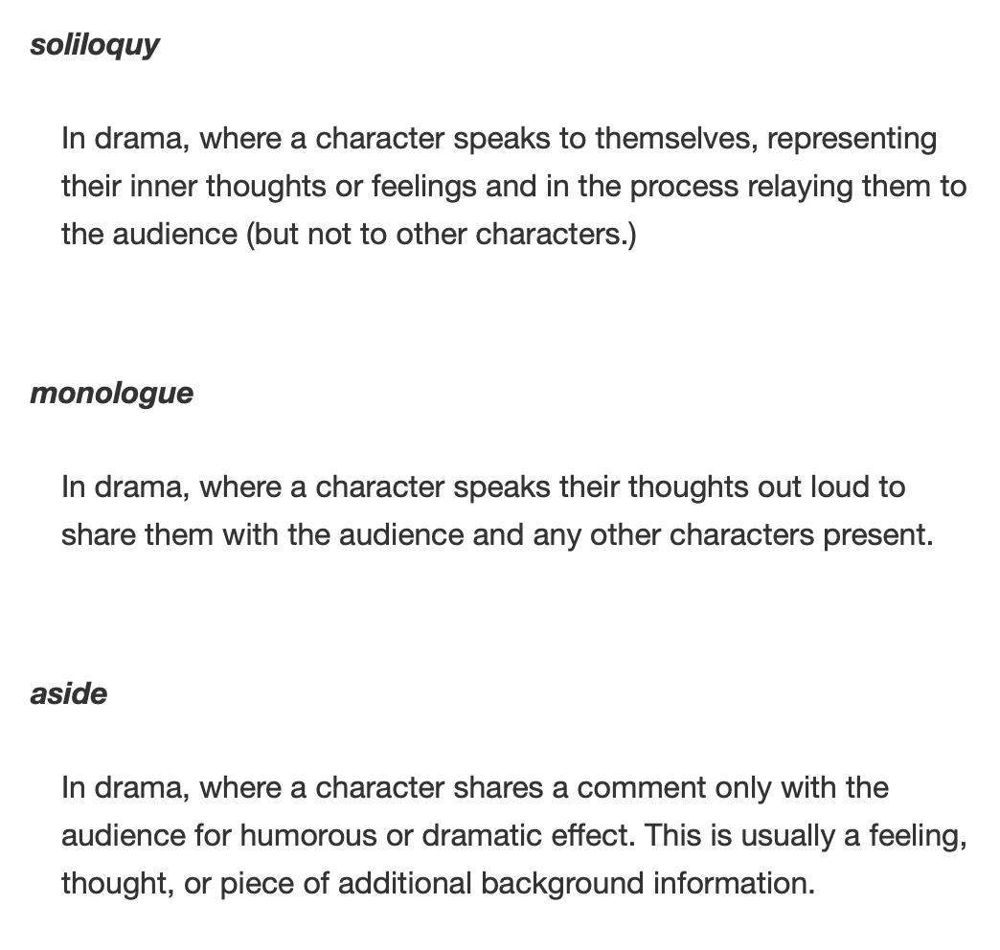
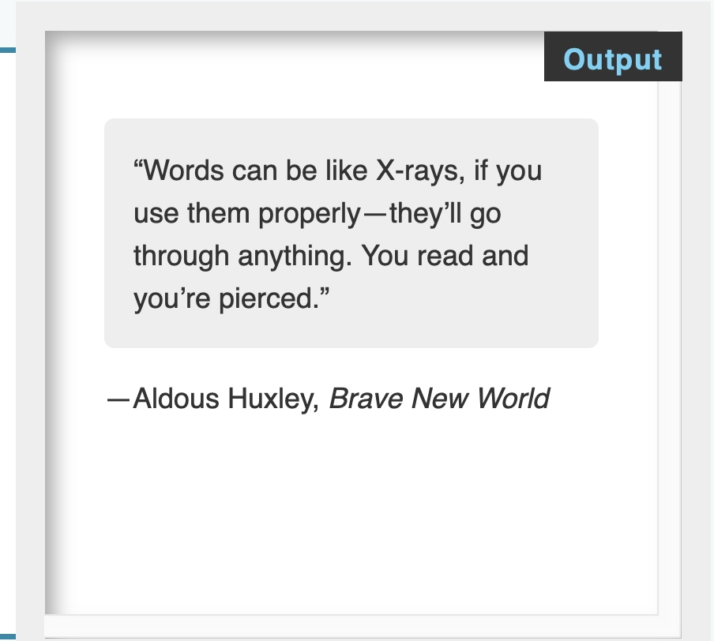

# 5 - Advanced text formatting
## Description lists
Description lists `<dl>`
description term `<dt>`
description definition `<dd>`


```html
<dl>
  <dt>soliloquy</dt>
  <dd>In drama, where a character speaks to themselves, representing their inner thoughts or feelings and in the process relaying them to the audience (but not to other characters.)</dd>
  <dt>monologue</dt>
  <dd>In drama, where a character speaks their thoughts out loud to share them with the audience and any other characters present.</dd>
  <dt>aside</dt>
  <dd>In drama, where a character shares a comment only with the audience for humorous or dramatic effect. This is usually a feeling, thought, or piece of additional background information.</dd>
</dl>
```

## Quotations
### Blockquotes
`</blockquote>`

### Inline quotations
`<q>`
### Citations
`<cite>`
### Abbreviations
`<abbr>` 

## Marking up contact details
HTML has an element for marking up contact details — `<address>`. This simply wraps around your contact details, for example:
```
<address>
  <p>
    Chris Mills<br>
    Manchester<br>
    The Grim North<br>
    UK
  </p>

  <ul>
    <li>Tel: 01234 567 890</li>
    <li>Email: me@grim-north.co.uk</li>
  </ul>
</address>
```


## Superscript and subscript
`<sup>``<sub>`

## Representing computer code
- `<code>`: For marking up generic pieces of computer code.
- `<pre>`: For retaining whitespace (generally code blocks) — if you use indentation or excess whitespace inside your text, browsers will ignore it and you will not see it on your rendered page. If you wrap the text in `<pre></pre>` tags however, your whitespace will be rendered identically to how you see it in your text editor.
- `<var>`: For specifically marking up variable names.
- `<kbd>`: For marking up keyboard (and other types of) input entered into the computer.
- `<samp>`: For marking up the output of a computer program.

## Marking up times and dates
`<time>`