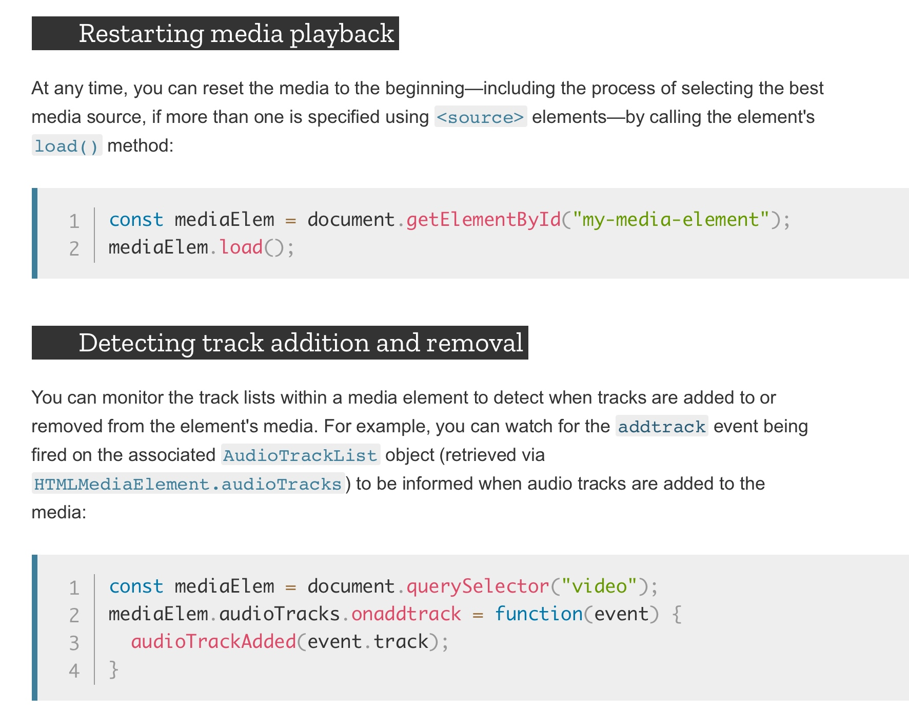

# 9 - Video and audio content
[MDN](https://developer.mozilla.org/en-US/docs/Learn/HTML/Multimedia_and_embedding/Video_and_audio_content)

## The <video> element
```html
<!-- `controls` is necessary  -->
<video controls>
  <source src="rabbit320.mp4" type="video/mp4">
  <source src="rabbit320.webm" type="video/webm">
  <p>Your browser doesn't support HTML5 video. Here is a <a href="rabbit320.mp4">link to the video</a> instead.</p>
</video>
```

better
```html
<video controls width="400" height="400"
       autoplay loop muted
       poster="poster.png">
  <source src="rabbit320.mp4" type="video/mp4">
  <source src="rabbit320.webm" type="video/webm">
  <p>Your browser doesn't support HTML video. Here is a <a href="rabbit320.mp4">link to the video</a> instead.</p>
</video>
```

### preload
`preload`
Used for buffering large files; it can take one of three values:

- "none" does not buffer the file
- "auto" buffers the media file
- "metadata" buffers only the metadata for the file

## audio
```html
<audio controls>
  <source src="viper.mp3" type="audio/mp3">
  <source src="viper.ogg" type="audio/ogg">
  <p>Your browser doesn't support HTML5 audio. Here is a <a href="viper.mp3">link to the audio</a> instead.</p>
</audio>
```


## Displaying video text tracks
```html
<video controls>
    <source src="example.mp4" type="video/mp4">
    <source src="example.webm" type="video/webm">
    <track kind="subtitles" src="subtitles_en.vtt" srclang="en">
</video>
```