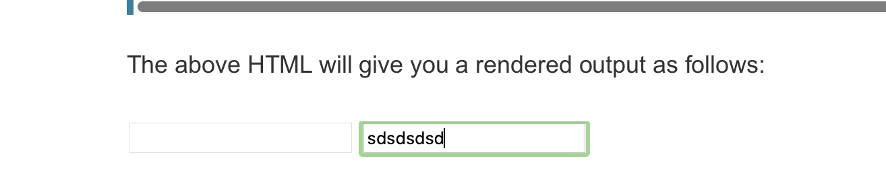

# What is HTML?

## Block versus inline elements
```html
<!-- inline -->
<em>first</em><em>second</em><em>third</em>
<!-- block -->
<p>fourth</p><p>fifth</p><p>sixth</p>
```
## Attributes
### Boolean attributes
```html
<!-- using the disabled attribute prevents the end user from entering text into the input box -->
<input type="text" disabled>

<!-- The user can enter text into the follow input, as it doesn't contain the disabled attribute -->
<input type="text">  
```

