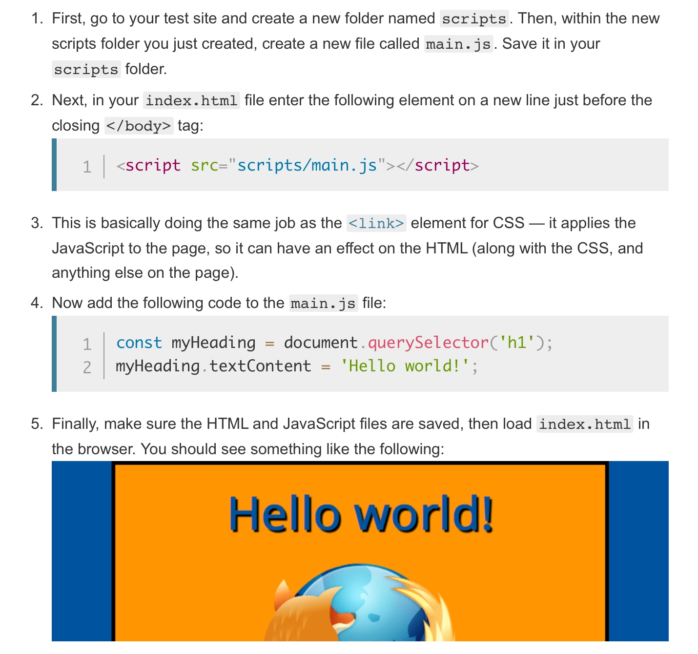

# whatz js
[JavaScript basics](https://developer.mozilla.org/en-US/docs/Learn/Getting_started_with_the_web/JavaScript_basics)

Document Object Model (DOM) API, which allows you to manipulate documents.


## demo 

DOM DOM DOM !!!
code 
```js
let myImage = document.querySelector('img');

myImage.onclick = function() {
    let mySrc = myImage.getAttribute('src');
    if(mySrc === 'images/firefox-icon.png') {
      myImage.setAttribute ('src','images/firefox2.png');
    } else {
      myImage.setAttribute ('src','images/firefox-icon.png');
    }
}
```